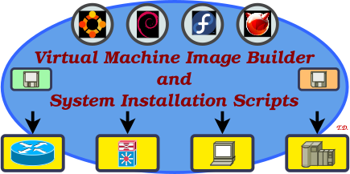

<h1 align="center">
 Virtual Machine Image Builder and System Installation Scripts<br />
 <a href="https://www.nntb.no/~dreibh/vmimage-builder-scripts/">
  <br />
  <span style="font-size: 75%;">https://www.nntb.no/~dreibh/vmimage-builder-scripts</span>
 </a>
</h1>


# Table of Contents

-   [What are the Virtual Machine Image Builder and System Installation Scripts](#what-are-the-virtual-machine-image-builder-and-system-installation-scripts)
-   [VM Types](#vm-types)
    -   [VirtualBox](#virtualbox)
    -   [Proxmox](#proxmox)
    -   [QEMU](#qemu)
    -   [vSphere](#vsphere)
    -   [Docker](#docker)
-   [Systems](#systems)
    -   [Ubuntu Linux](#ubuntu-linux)
    -   [Debian Linux](#debian-linux)
    -   [Fedora Core Linux](#fedora-core-linux)
    -   [FreeBSD](#freebsd)
-   [Projects](#projects)
    -   [Minimal](#minimal)
    -   [Basic](#basic)
    -   [KDE](#kde)
    -   [Development](#development)
    -   [KDE+Development](#kdedevelopment)
    -   [Further Projects](#further-projects)
        -   [NorNet](#nornet)
        -   [NorNet-Desktop](#nornet-desktop)
        -   [NEAT](#neat)
        -   [RSerPoolDemo](#rserpooldemo)
        -   [SimulaMet-Desktop](#simulamet-desktop)
        -   [5gVINNI](#gvinni)


# 💡 What are the Virtual Machine Image Builder and System Installation Scripts?

This repository contains Virtual Machine (VM) image building and system installation scripts, to automatically generate freshly installed VM or container images for different projects and purposes, like minimal servers, basic console setups, development environments, as well as full desktop machines. The scripts use Packer (<https://www.packer.io>).

As part of the VM setup process, it is also possible to set custom boot-splashes and desktop/screen locker/login background images for customisation.


# 💾 Sources

The Virtual Machine Image Builder and System Installation Scripts are released under the [GNU General Public Licence&nbsp;(GPL)](https://www.gnu.org/licenses/gpl-3.0.en.html#license-text).

The Git repository of the Virtual Machine Image Builder and System Installation Scripts sources can be found at [https://github.com/simula/nornet-vmimage-builder-scripts](https://github.com/simula/nornet-vmimage-builder-scripts):

```bash
git clone https://github.com/simula/nornet-vmimage-builder-scripts
cd nornet-vmimage-builder-scripts
```

Contributions:

* Issue tracker: [https://github.com/simula/nornet-vmimage-builder-scripts/issues](https://github.com/simula/nornet-vmimage-builder-scripts/issues).
  Please submit bug reports, issues, questions, etc. in the issue tracker!

* Pull Requests for the Virtual Machine Image Builder and System Installation Scripts: [https://github.com/simula/nornet-vmimage-builder-scripts/pulls](https://github.com/simula/nornet-vmimage-builder-scripts/pulls).
  Your contributions to the Virtual Machine Image Builder and System Installation Scripts are always welcome!


# ⭐ Requirements

The following installations of dependencies are necessary:

* [Packer](https://www.packer.io) (get up-to-date version from <https://www.packer.io>, the Ubuntu-provided package or snap is out-of-date!)
* Required [Packer](https://www.packer.io) plug-ins for the hypervisor, e.g.&nbsp;VirtualBox, QEMU, Proxmox, ...

  ```
  packer plugins install github.com/hashicorp/virtualbox
  packer plugins install github.com/hashicorp/proxmox
  packer plugins install github.com/hashicorp/qemu
  packer plugins install github.com/hashicorp/docker
  packer plugins install github.com/hashicorp/vsphere
  ...
  packer plugins installed
  ```

* [CMake](https://cmake.org/), [ExifTool](https://exiftool.org/), [Gimp](https://www.gimp.org/), [GraphicsMagick](http://www.graphicsmagick.org/), [Noto Fonts](https://fonts.google.com/noto), DejaVu Fonts, for building the boot-splash and desktop/screen locker/login background images:

  - Ubuntu/Debian:

     ```
     sudo apt-get install -y --no-install-recommends \
        cmake fonts-dejavu fonts-noto gimp graphicsmagick libimage-exiftool-perl
     ```

  - Fedora:

     ```
     sudo dnf install --setopt=install_weak_deps=False -y \
        awk cmake dejavu-sans-fonts gcc google-noto-sans-fonts GraphicsMagick gimp perl-Image-ExifTool
     ```
  - FreeBSD:

    ```
    sudo pkg install -y \
       cmake dejavu gimp3-app noto-sans GraphicsMagick p5-Image-ExifTool
    ```


# 💻 Usage

Take a look at the script [make-direct](https://github.com/simula/nornet-vmimage-builder-scripts/blob/master/make-direct) for installing of the system itself (i.e.&nbsp;*not* building VMs but configuring the system itself):
```
./make-direct <PROJECT>
```

To start a VM build, run one the the `make-*` scripts:
```
./make-<PROJECT>
```
with &lt;PROJECT&gt; e.g. "minimal", "basic", "development", "kde", "kde+development", "hipercontracer", etc.!

See further details about the different VM hypervisor variants, systems, and projects (choice of packages to install) below!


# 🎫 Hypervisors

## VirtualBox

The VirtualBox images use optimised settings for display, network and storage. Two disk layouts are available: 3-disks (separate disks for `/`, `/home`, and swap; recommended) and 1-disk (one disk for everything).

## Proxmox

VMs for usage in Proxmox. They are basically like the VirtualBox variant, with the QEMU Guest Agent installed. Two disk layouts are available: 3-disks (separate disks for `/`, `/home`, and swap; recommended) and 1-disk (one disk for everything).

## QEMU

The QEMU images use optimised settings for display, network and storage. Two disk layouts are available: 3-disks (separate disks for `/`, `/home`, and swap) and 1-disk (one disk for everything). The QEMU images are particularly useful for OpenStack, for which the disk layout should be 1-disk.

## vSphere

VMs for usage in vSphere. They are basically like the VirtualBox variant, with the Open VM Tools installed.

Note: The vSphere support of the scripts is *not* tested any more!

## Docker

Containers for usage in Docker.


# 💻 Systems

The following operating systems are currently supported as VM guests:

* [Ubuntu Linux](https://ubuntu.com/)
* [Debian Linux](https://www.debian.org/)
* [Fedora Core Linux](https://getfedora.org/de/)
* [FreeBSD](https://www.freebsd.org/)

Details can be found in the directories [installer](https://github.com/simula/nornet-vmimage-builder-scripts/tree/master/installer) and [http](https://github.com/simula/nornet-vmimage-builder-scripts/tree/master/http).

## Ubuntu Linux

General settings:

* Base: Ubuntu Server ISO
* EFI boot
* Using BTRFS for `/` and `/home`, with subvolumes `@` and `@home`
* Added Launchpad PPA dreibh/ppa (<https://launchpad.net/~dreibh/+archive/ubuntu/ppa/+packages>)
* Purged and blocked snapd. To install snapd again, remove `/etc/apt/preferences.d/block-snapd.pref`!

## Debian Linux

General settings:

* Base: Debian Netinstall ISO
* EFI boot
* Using BTRFS for `/` and `/home`, with subvolumes `@` and `@home`

## Fedora Core Linux

General settings:

* Base: Fedora Core Netinstall ISO
* EFI boot
* Using XFS for `/` and `/home`
* Added COPR PPA dreibh/ppa (<https://copr.fedorainfracloud.org/coprs/dreibh/ppa/>)

## FreeBSD

General settings:

* Base: FreeBSD installation ISO
* EFI boot
* Using ZFS for `/` and `/home`


# 📦 Projects

Details can be found in the directory [projects](https://github.com/simula/nornet-vmimage-builder-scripts/tree/master/projects).

## Minimal

The minimal installation for the system with the settings described above. This project is meant mainly for testing purposes. In most cases, you want the [Basic](#basic) project instead!

Provided packages:

* [Bash](https://www.gnu.org/software/bash/) (shell)
* [cURL](https://curl.se/) (download tool)
* [Git](https://git-scm.com/) (revision management)
* [GnuPG](https://www.gnupg.org/) (cryptography for signature checks)
* [Ping](https://en.wikipedia.org/wiki/Ping_(networking_utility)) (network connectivity check)
* [Sudo](https://www.sudo.ws/) (privileged command execution)
* [Virt-What](https://people.redhat.com/~rjones/virt-what/) (identification of virtualisation environment)

Further properties:

* `/etc/os-release` with operating system information exists
* Bash as default shell
* Explicit Congestion Notification (ECN, [RFC 3168](https://www.rfc-editor.org/rfc/rfc3168.html)) enabled
* Stream Control Transmission Protocol (SCTP, [RFC 4960](https://www.rfc-editor.org/rfc/rfc4960.html)) enabled
* SSH server enabled
* Hardened SSH server and client settings (weak algorithms disabled)
* UTF-8 character encoding
* Enabled automatic installation of updates


## Basic

The "Basic" installation is based on the [Minimal](#minimal) installation.

It must contain the following packages:

* [ACL](https://savannah.nongnu.org/projects/acl/) (Tools for ACL configuration, particularly getfacl and setfacl commands)
* [Base64](https://en.wikipedia.org/wiki/Base64) (base64 tool)
* [BIND Tools](https://www.isc.org/bind/) (DNS testing, particularly dig and delv commands)
* [BWM-NG](https://github.com/vgropp/bwm-ng) (simple bandwidth monitor)
* [BZip2](https://sourceware.org/bzip2/) (compression tool)
* [EthTool](https://mirrors.edge.kernel.org/pub/software/network/ethtool/) (Ethernet card configuration tool; on Linux systems only!)
* [Fail2Ban](https://github.com/fail2ban/fail2ban) (prevent brute-force SSH attacks)
* [GDisk](https://sourceforge.net/projects/gptfdisk/) (GPT partitioning tool)
* [GrowPart](https://manpages.ubuntu.com/manpages/plucky/man1/growpart.1.html) (Partition growing tool; on Linux systems only!)
* [IDN](https://www.gnu.org/software/libidn/manual/html_node/Invoking-idn.html) (Internationalised Domain Names command line tool)
* [GNU Parallel](https://www.gnu.org/software/parallel/) (Parallel job execution)
* [GNU Wget](https://www.gnu.org/software/wget/) (download tool)
* [HiPerConTracer](https://www.nntb.no/~dreibh/hipercontracer/) (high-performance network tracing tool)
* [HTop](https://htop.dev/) (process monitor)
* [Joe](https://joe-editor.sourceforge.io/) (editor)
* [JQ](https://jqlang.github.io/jq/) (JSON editing tool)
* [Less](https://github.com/gwsw/less) (Terminal pager)
* [NMap](https://nmap.org/) (network testing tool)
* [Manual page utilities](https://man7.org/linux/man-pages/man1/man.1.html) (manual page viewer)
* [NetPerfMeter](https://www.nntb.no/~dreibh/netperfmeter/) (network performance metering tool)
* [NetPlan](https://netplan.io/) (network configuration; on Linux systems only!)
* [OpenSSL](https://openssl.org/) (Cryptography and TLS toolkit)
* [Traceroute](https://en.wikipedia.org/wiki/Traceroute), [ifconfig](https://en.wikipedia.org/wiki/Ifconfig) (basic networking tools)
* [PLocate](https://plocate.sesse.net/) ("locate" command for finding files)
* [PwGen](https://opensource.com/article/21/7/generate-passwords-pwgen) (secure password generator)
* [Python](https://www.python.org/) (Python 3 interpreter)
* [RSPLIB](https://www.nntb.no/~dreibh/rserpool/) RSerPool Tools (RSerPool testing tools)
* [RSync](https://rsync.samba.org/) Tools (file synchronisation)
* [SubNetCalc](https://www.nntb.no/~dreibh/subnetcalc/) (address calculator)
* [System-Tools](https://www.nntb.no/~dreibh/system-tools/) (system information on login)
* [TCPDump](https://www.tcpdump.org/) (packet sniffer)
* [Tree](https://linux.die.net/man/1/tree) (tree view of directory hierachy)
* [TSCTP](https://www.nntb.no/~dreibh/tsctp/) (SCTP test tool)
* [T-Shark](https://www.wireshark.org/) (packet sniffer, CLI-version for Wireshark)
* [UUID](http://www.ossp.org/pkg/lib/uuid/) (UUID generator)
* [Zip](https://infozip.sourceforge.net/Zip.html) (Zip compression tools)


## KDE

The "KDE" installation is based on the [Basic](#basic) installation.

It must contain the following packages:

* The [KDE Plasma Desktop](https://kde.org/plasma-desktop/) with Oxygen theme and [SDDM](https://github.com/sddm/sddm)
* [DejaVu Fonts](https://dejavu-fonts.github.io/) ([DejaVu fonts)
* [Dia](https://wiki.gnome.org/Apps/Dia) (drawing tool)
* [Firefox](https://www.mozilla.org/en-US/firefox/new/) (web browser)
* [FractGen](https://www.nntb.no/~dreibh/fractalgenerator/) (fractal generator)
* [LibreOffice](https://www.libreoffice.org/) (office suite)
* [Gimp](https://www.gimp.org/) (graphics editing tool)
* [Inkscape](https://inkscape.org/) (drawing tool)
* [Kate](https://kate-editor.org/) (editor)
* [Kile](https://kile.sourceforge.io/) (LaTeX editor)
* [Konsole](https://konsole.kde.org/) (console)
* [Noto Fonts](https://fonts.google.com/noto) (Noto fonts, complete UTF-8 character range)
* [Okteta](https://apps.kde.org/okteta/) Hex editor)
* [Okular](https://okular.kde.org/) (file viewer, e.g. for PDF)
* [Open Sans Fonts](https://fonts.google.com/specimen/Open+Sans) (Open Sans fonts)
* [R](https://www.r-project.org/) (statistical computing suite)
* [Strawberry Music Player](https://www.strawberrymusicplayer.org/) (audio player)
* [Wireshark](https://www.wireshark.org/) (packet sniffer, GUI version)

Further properties:

* Configured KDE and SDDM login manager
* Configured 4 virtual desktops
* Configured switchable keyboard layouts
* Configured Konsole keyboard shortcuts
* Configured Firefox (hardened settings, enhanced privacy settings, as well as some add-ons like NoScript, uBlock Origin, etc.)
* Configured Wireshark (predefined filters, coloring rules, etc.)
* Ubuntu 22.04+: Firefox is installed from PPA mozillateam/ppa (<https://launchpad.net/~mozillateam/+archive/ubuntu/ppa/+packages>), instead of using the Snap package.


## Development

The "Development" installation is based on the [Basic](#basic) installation.

It must contain the following packages:

* [BC](https://pubs.opengroup.org/onlinepubs/9699919799/utilities/bc.html) (arbitrary precision calculator language)
* [CLang](https://clang.llvm.org/) (CLang C and C++ compilers)
* [CMake](https://cmake.org/) (build tool)
* [DejaVu Fonts](https://dejavu-fonts.github.io/) ([DejaVu fonts)
* [ExifTool](https://exiftool.org/) (EXIF metadata editing tool for images)
* [Docker](https://www.docker.com/) (Docker container management; on Linux systems only!)
* [GhostScript](https://www.ghostscript.com/) (PostScript interpreter and fonts)
* [GNU Autotools (Autoconf/Automake/Libtool)](https://en.wikipedia.org/wiki/GNU_Autotools) (basic build tools)
* [GNU Bison](https://www.gnu.org/software/bison/) (parser generator)
* [Flex](https://github.com/westes/flex) (lexical analyser generator)
* [GNU GCC/G++, GNU Make, GNU Debugger](https://gcc.gnu.org/) (compilers, debugger and make tool)
* [Git LFS](https://git-lfs.com/) (large file storage for Git)
* [GraphicsMagick](http://www.graphicsmagick.org/) (image conversion)
* [Noto Fonts](https://fonts.google.com/noto) (Noto fonts, complete UTF-8 character range)
* [PkgConfig](https://www.freedesktop.org/wiki/Software/pkg-config/) (metainformation about installed libraries)
* [Open Sans Fonts](https://fonts.google.com/specimen/Open+Sans) (Open Sans fonts)
* [Python](https://www.python.org/) (Python 3 interpreter, tools and PIP package management)
* [ShellCheck](https://www.shellcheck.net/) (checker tool for shell scripts)
* [Tidy](https://www.html-tidy.org/) (HTML/XML syntax checker and reformatter)
* [URW Base 35 Fonts](https://github.com/ArtifexSoftware/urw-base35-fonts) (URW Base 35 fonts)
* [Valgrind](https://valgrind.org/) (debugging tool; if available for architecture)
* [YamlLint](https://github.com/adrienverge/yamllint) (checker tool for YAML)
* [RepRepro](https://wiki.debian.org/DebianRepository/SetupWithReprepro) (DEB repository build tool; on Linux systems only!)
* [PBuilder](https://pbuilder-team.pages.debian.net/pbuilder/) (DEB build tool; on Linux systems only!)

It must contain the following libraries and development files:

* [BOOST C++ Libraries](https://www.boost.org/) (portable C++ libraries)
* SCTP development files

Further properties:

* Password-less sudo calls. ⚠WARNING: Development settings are intended for developers only!
* Wireshark as regular user is allowed. ⚠WARNING: Development settings are intended for developers only!
* Source packages enabled from package manager (if available)


## KDE+Development

The "KDE+Development" installation is based on the [KDE](#kde) and [Development](#development) installation.


## Further Projects

### NorNet

Basic for general-purpose server usage, particularly for working with [NorNet](https://www.nntb.no/) purposes.

### NorNet-Desktop

Basic NorNet VMs for general-purpose desktop usage. They base on the NorNet images, with additional KDE desktop.

### NEAT

Basic for general-purpose desktop usage, particularly for working with [NEAT](https://neat.nntb.no/). They base on the NorNet-Desktop images, with NEAT packages and build environment.

Features:

* [NEAT](https://github.com/NEAT-project/neat) installed (NEAT library as well as NEAT sockets API library).
* Source repositories cloned under `$HOME/src`. Build dependencies are already installed.

### RSerPoolDemo

Basic for general-purpose desktop usage, particularly for working with [RSerPool](https://www.nntb.no/~dreibh/rserpool/),
based on the [KDE+Development](#kdedevelopment) installation.

Features:

* [RSPLIB](https://www.nntb.no/~dreibh/rserpool/index.html#Download) installed.
* [RSerPoolDemo-Tool](https://www.nntb.no/~dreibh/rserpool/index.html#DemoTool) installed.
* Source repositories cloned under `$HOME/src`. Build dependencies are already installed.

### SimulaMet-Desktop

These are SimulaMet desktop VMs, based on the [KDE+Development](#kdedevelopment) installation.

Features:

* Some [SimulaMet](https://code.simula.no/)-related source repositories cloned under `$HOME/src`.

### 5gVINNI

Basic for general-purpose desktop usage, particularly for working with [5gVINNI](https://www.5g-vinni.eu/). They base on the NorNet images.


# 🔗 Useful Links

## Networking and System Management Software

* [System-Tools – Tools for Basic System Management](https://www.nntb.no/~dreibh/system-tools/)
* [NetPerfMeter – A TCP/MPTCP/UDP/SCTP/DCCP Network Performance Meter Tool](https://www.nntb.no/~dreibh/netperfmeter/)
* [HiPerConTracer – High-Performance Connectivity Tracer](https://www.nntb.no/~dreibh/hipercontracer/)
* [Dynamic Multi-Homing Setup (DynMHS)](https://www.nntb.no/~dreibh/dynmhs/)
* [SubNetCalc – An IPv4/IPv6 Subnet Calculator](https://www.nntb.no/~dreibh/subnetcalc/)
* [TSCTP – An SCTP Test Tool](https://www.nntb.no/~dreibh/tsctp/)
* [Thomas Dreibholz's Reliable Server Pooling Page](https://www.nntb.no/~dreibh/rserpool/)
* [Thomas Dreibholz's SCTP Page](https://www.nntb.no/~dreibh/sctp/)
* [Wireshark](https://www.wireshark.org/)

## Projects using the VM Image Builder and System Installation Scripts

* [NorNet – A Real-World, Large-Scale Multi-Homing Testbed](https://www.nntb.no/)
* [GAIA – Cyber Sovereignty](https://gaia.nntb.no/)
* [RAKSHA – 5G Security for Critical Communications](https://www.simulamet.no/research/projects/raksha-5g-security-critical-communications)
* [5G-VINNI – 5G Verticals Innovation Infrastructure](https://www.5g-vinni.eu/)
* [HENCSAT – Highly Efficient Network Coding for Satellite Applications Test-bed](https://connectivity.esa.int/projects/hencsat)
* [SEARCH – Synthetic Healthcare Data Governance Hub](https://ihi-search.eu/)
* [MELODIC – Multi-Cloud Execution-Ware for Large-scale Optimised Data-Intensive Computing](https://melodic.cloud/)
* [NEAT – A New, Evolutive API and Transport-Layer Architecture for the Internet](https://neat.nntb.no/)
* [RITE  – Reducing Internet Transport Latency](https://web.archive.org/web/20221006013921/https://riteproject.eu/)
